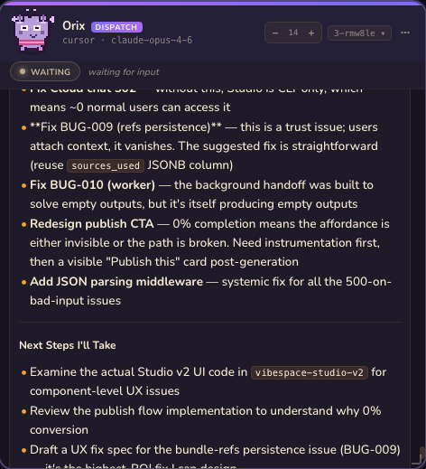

<p align="center">
  
</p>

<h1 align="center">Thronglets</h1>

<p align="center">
  <strong>Spawn a fleet of AI coding agents from Telegram. Each one gets a name, a pixel art avatar, and a workspace.</strong>
</p>

<p align="center">
  <a href="https://github.com/simontt88/thronglets/stargazers"></a>
  <a href="https://github.com/simontt88/thronglets/blob/main/LICENSE"></a>
  <a href="https://www.npmjs.com/package/thronglets"></a>
  <a href="https://github.com/simontt88/thronglets/actions"></a>
</p>

<p align="center">
  <a href="#quick-start">Quick Start</a> ·
  <a href="#features">Features</a> ·
  <a href="#how-it-works">How It Works</a> ·
  <a href="#commands">Commands</a> ·
  <a href="#configuration">Configuration</a> ·
  <a href="#architecture">Architecture</a> ·
  <a href="#contributing">Contributing</a>
</p>

---

## Why "Thronglets"?

The name comes from *Black Mirror* — those little digital creatures living inside a simulation. We thought it was funny for coding agents. It stuck.

Here's the thing: you already have great AI agents. Your Cursor session knows your codebase. Your Claude Code terminal can refactor anything. But they're each stuck in their own window, and you're the only one routing work between them.

So we built the missing piece — a **dispatcher agent** that sits in its own workspace, sees the entire fleet, and routes tasks to the right thronglet. You just type into Telegram. The dispatcher figures out who's free, what workspace matches, and forwards your message. When you're not even talking, you can `/poke` the dispatcher and it'll look at its goal and start assigning work to idle agents on its own.

Every thronglet gets a procedurally generated name and a pixel art face. Same name always produces the same creature. They have moods — grinding, waiting, sleeping, dead. It's cosmetic, but it makes you actually care when one of them dies.

```
You:        fix the tests          (no @mention — dispatcher handles it)
Dispatcher: Routing to Kilo (idle, assigned to infra workspace)
Kilo:       Found the issue — Node 18 assertion, fixing...

You:        @Vexo refactor the auth module
Vexo:       On it — restructuring into middleware pattern...
```

Not a new AI framework. No DSL, no "agentic workflow engine." Just identity, a dispatcher, and a message bus on top of tools you already use.

## Quick Start

```bash
git clone https://github.com/simontt88/thronglets.git
cd thronglets && npm install
```

Set your keys:

```bash
export TELEGRAM_BOT_TOKEN="your-bot-token"       # from @BotFather
export CURSOR_API_KEY="your-cursor-api-key"       # from cursor.com/settings
export BRIDGE_WORKSPACE="/path/to/your/project"
```

Launch:

```bash
npm start
```

Open Telegram → `/new` → watch your first thronglet hatch.

## See It In Action

| Spawn from Telegram | Agent at work |
|:---:|:---:|
|  |  |

## Features

| Feature | Description |
|---------|-------------|
| **Fleet Management** | Spawn, kill, reconfigure agents on the fly. Each has its own session, workspace, and identity |
| **Procedural Avatars** | Every agent gets a unique pixel art creature — deterministic from name, with mood animations (idle, working, happy, sleeping, dead) |
| **Dispatcher Agent** | A dedicated agent with its own workspace that manages the fleet. Routes messages by workspace match and runtime strength. Has a persistent goal — `/poke` it and it autonomously assigns work to idle thronglets |
| **Multi-Runtime** | Cursor SDK, Claude Code CLI, OpenAI Codex — mix runtimes in the same fleet |
| **Multi-Platform** | Telegram (primary), Lark/Feishu, Discord transports |
| **Web Dashboard** | Real-time fleet visualization with session history, live output streaming, and agent state |
| **Inter-Agent Comms** | Agents can message each other via `[FLEET:SEND]` markers. Request-reply pattern with routing |
| **Auto-Recovery** | Heartbeat monitoring, dead agent detection, automatic restart without manual intervention |
| **Session Management** | Archive and recall past sessions per agent. Clear context without killing the creature |
| **Workspace Isolation** | Each agent can be assigned to a different project directory |

## How It Works

<p align="center">
  
</p>

The **dispatcher** is itself an agent (named Orix) with its own workspace. It receives every unaddressed message, sees the full fleet status (who's idle, who's working, which workspace each agent is in), and forwards tasks using `fleet_send`. It maintains a persistent goal — `/poke` it and it proactively assigns work to idle thronglets.

Each thronglet runs as a separate agent session:
- **Cursor agents** use `@cursor/sdk` — full IDE capabilities, file editing, terminal access
- **Claude Code agents** use the Claude Code CLI — terminal-native coding
- **Codex agents** use `@openai/codex-sdk` — OpenAI's coding agent

## Commands

| Command | Description |
|---------|-------------|
| `/new [name] [runtime] [workspace]` | Hatch a thronglet (auto-named if omitted) |
| `/kill <name>` | Release a thronglet |
| `/fleet` | Show all thronglets with status |
| `/status [name]` | Detailed thronglet info |
| `/title <name> <title>` | Set a thronglet's role/title |
| `/workspace [add alias path]` | List or register workspaces |
| `/dispatcher [restart]` | Dispatcher status or restart |
| `/clear <name>` | Archive session, fresh context |
| `/change <name> <field> <value>` | Reconfigure runtime/model/workspace |
| `/help` | Show all commands |

### Messaging

| Pattern | Behavior |
|---------|----------|
| `@name message` | Send directly to a specific thronglet |
| `@D message` | Route to the dispatcher |
| `@all message` | Broadcast to all thronglets |
| Plain text | Auto-routes via the dispatcher |

## Configuration

Create `~/.thronglets/config.yaml`:

```yaml
transport: telegram
workspace: /path/to/your/project

telegram:
  token: ${TELEGRAM_BOT_TOKEN}
  allowed_chats:
    - "your-chat-id"

agents:
  - name: cursor
    runtime: cursor
    api_key: ${CURSOR_API_KEY}
    model: claude-sonnet-4-6

dispatcher:
  enabled: true
  runtime: cursor
  workspace: /path/to/orchestrator
```

See [`bridge.yaml.example`](bridge.yaml.example) for the full reference.

### Supported Runtimes

| Runtime | SDK | Requirements |
|---------|-----|-------------|
| Cursor | `@cursor/sdk` | Cursor API key ([cursor.com/settings](https://cursor.com/settings)) |
| Claude Code | CLI subprocess | Claude Code installed + API key |
| Codex | `@openai/codex-sdk` | OpenAI API key |

### Supported Transports

| Transport | Status | Connection |
|-----------|--------|------------|
| Telegram | Stable | Long-polling via Bot API |
| Lark/Feishu | Beta | Event subscription |
| Discord | Beta | Gateway WebSocket |

## Architecture

```
src/
├── fleet/            # Fleet management core
│   ├── manager.ts    # Agent lifecycle + message routing
│   ├── dispatcher.ts # AI-powered task router
│   ├── tools.ts      # Inter-agent communication markers
│   ├── event-bus.ts  # Real-time event pub/sub
│   ├── state.ts      # Persistent fleet state
│   ├── naming.ts     # Procedural name generator
│   └── types.ts      # TypeScript interfaces
├── transports/       # Messaging platform adapters
│   ├── telegram.ts
│   ├── lark.ts
│   └── discord.ts
├── runtimes/         # Agent SDK backends
│   ├── cursor.ts
│   ├── claude-code.ts
│   └── codex.ts
├── server/           # HTTP API + WebSocket
│   └── http.ts
├── config.ts         # YAML + env var config loader
└── index.ts          # Entrypoint

packages/
└── dashboard/        # Vite + React web UI
    └── src/
        ├── components/     # Fleet cards, chat, spawn dialog
        └── lib/thronglet/  # Procedural pixel art engine
```

### Extending

**Add a transport** — implement the `Transport` interface:

```typescript
interface Transport {
  name: string;
  start(): Promise<void>;
  stop(): Promise<void>;
  onMessage(handler: (msg: IncomingMessage) => Promise<void>): void;
  sendReply(chatId: string, text: string): Promise<void>;
  sendTyping(chatId: string): Promise<void>;
}
```

**Add a runtime** — implement the `Runtime` interface:

```typescript
interface Runtime {
  name: string;
  createSession(opts: RuntimeSessionOptions): Promise<AgentSession>;
}
```

## Comparison

| Feature | Thronglets | [agent-orchestrator](https://github.com/composiohq/agent-orchestrator) | [hive](https://github.com/adenhq/hive) |
|---------|-----------|------|------|
| **Primary interface** | Telegram/Lark/Discord chat | CLI/GitHub | CLI/API |
| **Agent identity** | Procedural names + pixel art avatars | Generic workers | Anonymous agents |
| **Dispatch** | AI-powered smart routing | Task DAG planning | Graph-based DAG |
| **Runtimes** | Cursor + Claude Code + Codex | Claude Code + Codex + Aider | Model-agnostic |
| **Dashboard** | Real-time web UI with creature visualization | Terminal UI | Web observability |
| **Setup** | `npm install` + env vars | `npm install` + config | Docker/Python |
| **Focus** | Chat-first fleet management | CI/PR-oriented parallel coding | Business workflow automation |

## Roadmap

- [ ] **Memory layer** — persistent cross-session context per thronglet
- [ ] **Slack transport** — Slack bot adapter
- [ ] **Agent-to-agent delegation** — thronglets assigning subtasks to each other
- [ ] **npm global install** — `npx thronglets` one-liner setup
- [ ] **Docker image** — zero-dependency deployment
- [ ] **Plugin system** — custom tools and behaviors per thronglet

## Contributing

Contributions welcome! See [CONTRIBUTING.md](CONTRIBUTING.md) for guidelines.

```bash
git clone https://github.com/simontt88/thronglets.git
cd thronglets && npm install
npm run dev   # starts with --watch
```

## License

[MIT](LICENSE) — use it, fork it, hatch your own thronglets.

---

<p align="center">
  <sub>Built with love and procedural pixel art. If this project is useful to you, please consider giving it a ⭐</sub>
</p>
