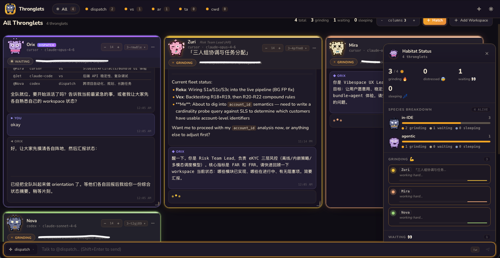
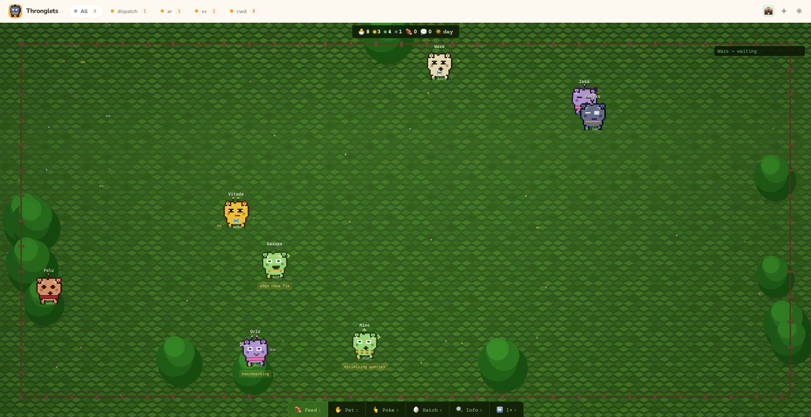
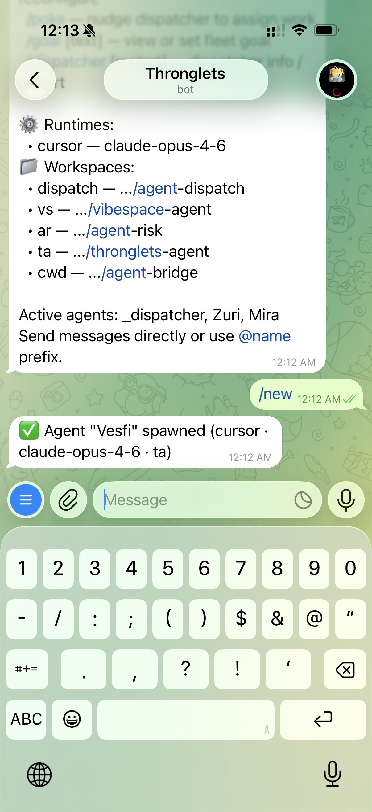

<h1 align="center">Thronglets</h1>

<p align="center">
  <strong>Spawn a fleet of AI coding agents from Telegram, Lark, or Discord. Each one gets a name, a pixel art avatar, and a workspace.</strong>
</p>

<p align="center">
  <a href="https://github.com/simontt88/thronglets/stargazers"></a>
  <a href="https://github.com/simontt88/thronglets/blob/main/LICENSE"></a>
  <a href="https://www.npmjs.com/package/thronglets"></a>
  <a href="https://github.com/simontt88/thronglets/actions"></a>
</p>

<p align="center">
  <a href="#quick-start">Quick Start</a> ·
  <a href="#features">Features</a> ·
  <a href="#how-it-works">How It Works</a> ·
  <a href="#commands">Commands</a> ·
  <a href="#configuration">Configuration</a> ·
  <a href="#architecture">Architecture</a> ·
  <a href="#contributing">Contributing</a>
</p>

---

<p align="center">
  
</p>

<table>
  <tr>
    <td width="60%">
      
      <p align="center"><sub>Chill mode — your throngs roaming as pixel creatures</sub></p>
    </td>
    <td width="40%">
      
      <p align="center"><sub>Telegram — hatch and manage from your phone</sub></p>
    </td>
  </tr>
</table>

<details>
<summary><strong>🎬 Demo videos</strong> (click to expand)</summary>
<br>

**Dashboard walkthrough** — studio mode, agent chat, live output

<video src="https://github.com/simontt88/thronglets/releases/download/v0.7.0/thronglets_interface_example.mp4" controls width="100%"></video>

**Telegram bot** — spawning, routing, fleet management

<video src="https://github.com/simontt88/thronglets/releases/download/v0.7.0/thronglets_telegram_example.mp4" controls width="100%"></video>

</details>

## Why "Thronglets"?

The name comes from *Black Mirror* — those little digital creatures trapped in a simulation. We thought it was funny for coding agents. It stuck.

You already have great AI coding agents — Cursor, Claude Code, Codex. But each one lives in its own window, and *you're* the bottleneck, manually routing tasks between them.

Thronglets fixes that. You get a **dispatcher** — itself an AI agent — that sits in its own workspace, sees the whole fleet, and routes work to the right throng. You just type into Telegram (or Lark, or Discord). The dispatcher figures out who's free, which workspace matches, and forwards your message. When you're not even talking to it, `/poke` the dispatcher and it'll check its goal and start assigning work on its own.

```
You:        fix the tests
Dispatcher: Routing to Kilo (idle, assigned to infra workspace)
Kilo:       Found the issue — Node 18 assertion, fixing...

You:        @Vexo refactor the auth module
Vexo:       On it — restructuring into middleware pattern...
```

Every throng gets a procedurally generated name and a pixel art face. Same name always produces the same creature. They have moods — working, waiting, sleeping, dead. It's purely cosmetic, but you *will* feel bad when one of them dies.

No new framework. No DSL. Just identity, a dispatcher, and a message bus on top of tools you already use.

## Quick Start

**Prerequisites:** Node.js 18+, a [Telegram bot token](https://t.me/BotFather), a [Cursor API key](https://cursor.com/settings).

```bash
git clone https://github.com/simontt88/thronglets.git
cd thronglets && npm install
```

Configure:

```bash
mkdir -p ~/.thronglets
cp config.yaml.example ~/.thronglets/config.yaml
```

Edit `~/.thronglets/config.yaml` — set your `token`, `api_key`, and `allowed_chats` (get your chat ID from [@userinfobot](https://t.me/userinfobot)).

Build the dashboard (optional):

```bash
cd packages/dashboard && npm install && npm run build && cd ../..
```

Launch:

```bash
npm start
```

Open Telegram → `/hatch` → watch your first throng hatch. The web dashboard is at `http://localhost:3847`.

## Features

| Feature | Description |
|---------|-------------|
| **Fleet Management** | Spawn, kill, reconfigure agents on the fly. Each has its own session, workspace, and identity |
| **Procedural Avatars** | Every agent gets a unique pixel art creature — deterministic from name, with mood animations (working, waiting, sleeping, dead) |
| **Dispatcher Agent** | A dedicated agent with its own workspace that manages the fleet. Routes messages by workspace match. Has a persistent goal — `/poke` it and it autonomously assigns work to idle throngs |
| **Comms Control** | Three modes — `swarm` (free chat), `hive` (hub-and-spoke), `leash` (human-only). Configurable Telegram visibility |
| **Multi-Platform** | Telegram (primary), Lark/Feishu, Discord. Lark and Discord require their respective SDK (`npm install @larksuiteoapi/node-sdk` or `discord.js`) |
| **Web Dashboard** | Real-time fleet visualization with session history, live output streaming, and agent state |
| **Auto-Recovery** | Heartbeat monitoring, dead agent detection, automatic restart without manual intervention |
| **Session Logging** | Per-agent session logs (JSONL). Clear context without killing the creature |
| **Workspace Isolation** | Each agent can be assigned to a different project directory |

## How It Works

```
┌──────────┐         ┌──────────────┐         ┌──────────────┐
│ Telegram │ ──────▶ │  Dispatcher  │ ──────▶ │    Throng    │
│  / Lark  │         │   (Orix)     │         │   (Zuri)     │
└──────────┘         └──────┬───────┘         └──────────────┘
     ▲                      │
     │                      │                 ┌──────────────┐
     │                      └───────────────▶ │    Throng    │
     │                                        │   (Mira)     │
     │         ┌──────────────┐               └──────────────┘
     └──────── │  Dashboard   │
               │  (localhost) │
               └──────────────┘
```

The **dispatcher** is itself an agent with its own workspace. It receives every unaddressed message, sees the full fleet status (who's idle, who's working, which workspace each agent is in), and forwards tasks using `fleet_send`. It maintains a persistent goal — `/poke` it and it proactively assigns work to idle throngs.

Each throng runs as a separate agent session (Cursor SDK, Claude Code, or Codex) with full IDE capabilities.

## Communication Modes

Control how throngs communicate with each other. Set `fleet.comms` in your config:

```
SWARM                    HIVE (default)            LEASH
─────                    ──────────────            ─────

   You                      You                      You
    │                        │                       ╱   ╲
    ▼                        ▼                      ▼     ▼
Dispatcher              Dispatcher              Dispatcher
  ▼    ▼                  ▼    ▲ ▲                ▼     ▼
Zuri ⇄ Mira             Zuri   Mira             Zuri   Mira
                         (no cross-talk)         (reply to you only)
```

| Mode | Throng → Throng | Throng → Dispatcher | Throng → Human | Dispatcher → Throng |
|------|:---:|:---:|:---:|:---:|
| **`swarm`** | OK | OK | OK | OK |
| **`hive`** (default) | Blocked | OK | OK | OK |
| **`leash`** | Blocked | Blocked | OK | OK |

- **swarm** — free-roaming. Throngs message anyone, including each other.
- **hive** — hub-and-spoke. Throngs report to the dispatcher only. No cross-talk. Recommended.
- **leash** — throngs only respond to the human. The dispatcher can still push tasks to them, but throngs can't initiate messages to anyone except the user.

## Commands

| Command | Description |
|---------|-------------|
| `/hatch [runtime] [workspace]` | Hatch a throng (auto-named) |
| `/kill <name>` | Release a throng |
| `/fleet` | Show all throngs with status |
| `/status [name]` | Detailed throng info |
| `/title <name> <title>` | Set a throng's role/title |
| `/workspace [add alias path]` | List or register workspaces |
| `/dispatcher [restart]` | Dispatcher status or restart |
| `/clear <name>` | Archive session, fresh context |
| `/change <name> <field> <value>` | Reconfigure runtime/model/workspace |
| `/poke` | Nudge dispatcher to assign work |
| `/goal [text]` | View or set fleet goal |
| `/help` | Show all commands |

### Messaging

| Pattern | Behavior |
|---------|----------|
| `@name message` | Send directly to a specific throng |
| `@D message` | Route to the dispatcher |
| `@all message` | Broadcast to all throngs |
| Plain text | Auto-routes via the dispatcher |

## Configuration

Create `~/.thronglets/config.yaml`:

```yaml
transport: telegram

telegram:
  token: ${TELEGRAM_BOT_TOKEN}
  allowed_chats:
    - "your-chat-id"

agents:
  - name: default
    runtime: cursor
    api_key: ${CURSOR_API_KEY}
    model: claude-opus-4-6

dispatcher:
  enabled: true

fleet:
  comms: hive               # swarm | hive | leash
  visibility:
    inter_agent: summary    # full | summary | off
    tool_calls: true
```

See [`config.yaml.example`](config.yaml.example) for the full reference.

### Environment Variables

| Variable | Default | Description |
|----------|---------|-------------|
| `TELEGRAM_BOT_TOKEN` | — | Telegram bot token (from [@BotFather](https://t.me/BotFather)) |
| `CURSOR_API_KEY` | — | API key for the agent runtime (from [cursor.com/settings](https://cursor.com/settings)) |
| `THRONGLETS_HOME` | `~/.thronglets` | Config directory override |
| `BRIDGE_PORT` | `3847` | Dashboard / API port |
| `BRIDGE_TRANSPORT` | `telegram` | Transport: `telegram`, `lark`, `discord` |
| `BRIDGE_WORKSPACE` | cwd | Default workspace path |
| `TELEGRAM_ALLOWED_CHATS` | — | Comma-separated chat IDs |

### Supported Runtimes

| Runtime | Status | Default model | SDK |
|---------|--------|---------------|-----|
| **Cursor** | Stable — primary, well-tested | `claude-opus-4-6` | `@cursor/sdk` (bundled) |
| **Claude Code** | Experimental | — | `@anthropic-ai/claude-agent-sdk` (bundled) |
| **Codex** | Experimental | — | `@openai/codex-sdk` (bundled) |

> Cursor is the primary runtime and the one we test against day-to-day. Claude Code and Codex runtimes are implemented and functional, but haven't received the same level of testing. Contributions and bug reports welcome!

### Supported Transports

| Transport | Status | Connection | Setup |
|-----------|--------|------------|-------|
| Telegram | Stable | Long-polling via Bot API | Bundled |
| Lark/Feishu | Experimental | Event subscription | `npm install @larksuiteoapi/node-sdk` |
| Discord | Experimental | Gateway WebSocket | `npm install discord.js` |

## Architecture

```
src/
├── fleet/            # Fleet management core
│   ├── manager.ts    # Agent lifecycle + message routing
│   ├── dispatcher.ts # AI-powered task router
│   ├── tools.ts      # Inter-agent communication markers
│   ├── preamble.ts   # System prompt generation
│   ├── state.ts      # Persistent fleet state
│   ├── naming.ts     # Procedural name generator (auto-assigned)
│   └── types.ts      # TypeScript interfaces
├── transports/       # Messaging platform adapters
│   ├── telegram.ts
│   ├── lark.ts
│   └── discord.ts
├── runtimes/         # Agent SDK backends
│   ├── interface.ts  # Runtime contract
│   ├── cursor.ts     # Cursor SDK
│   ├── claude-code.ts # Claude Code
│   └── codex.ts      # OpenAI Codex
├── server/           # HTTP API + WebSocket
│   ├── http.ts
│   └── ws.ts
├── config.ts         # YAML + env var config loader
└── index.ts          # Entrypoint

packages/
└── dashboard/        # Vite + React web UI
    └── src/
        ├── components/     # Fleet cards, chat, spawn dialog
        └── lib/thronglet/  # Procedural pixel art engine
```

### Extending

**Add a transport** — implement the `Transport` interface:

```typescript
interface Transport {
  name: string;
  start(): Promise<void>;
  stop(): Promise<void>;
  onMessage(handler: (msg: IncomingMessage) => Promise<void>): void;
  sendReply(chatId: string, text: string): Promise<void>;
  sendTyping(chatId: string): Promise<void>;
}
```

**Add a runtime** — implement the `Runtime` interface:

```typescript
interface Runtime {
  name: string;
  createSession(opts: RuntimeSessionOptions): Promise<AgentSession>;
}
```

## Comparison

| Feature | Thronglets | [agent-orchestrator](https://github.com/composiohq/agent-orchestrator) | [hive](https://github.com/adenhq/hive) |
|---------|-----------|------|------|
| **Primary interface** | Telegram/Lark/Discord chat | CLI/GitHub | CLI/API |
| **Agent identity** | Procedural names + pixel art avatars | Generic workers | Anonymous agents |
| **Dispatch** | AI-powered smart routing | Task DAG planning | Graph-based DAG |
| **Runtimes** | Cursor SDK, Claude Code, Codex | Claude Code + Codex + Aider | Model-agnostic |
| **Dashboard** | Real-time web UI with creature visualization | Terminal UI | Web observability |
| **Setup** | `npm install` + env vars | `npm install` + config | Docker/Python |
| **Focus** | Chat-first fleet management | CI/PR-oriented parallel coding | Business workflow automation |

## Roadmap

- [x] **npm CLI** — `npx thronglets` global install
- [x] **Docker image** — `docker build` support
- [ ] **Memory layer** — persistent cross-session context per throng
- [ ] **Slack transport** — Slack bot adapter
- [ ] **Session recall** — search and resume past agent sessions
- [ ] **Plugin system** — custom tools and behaviors per throng

## Contributing

Contributions welcome! See [CONTRIBUTING.md](CONTRIBUTING.md) for guidelines.

```bash
git clone https://github.com/simontt88/thronglets.git
cd thronglets && npm install
npm run dev   # starts with --watch
```

## License

[MIT](LICENSE) — use it, fork it, hatch your own throngs.

---

<p align="center">
  <sub>Built with love and procedural pixel art. If this project is useful to you, please consider giving it a ⭐</sub>
</p>
